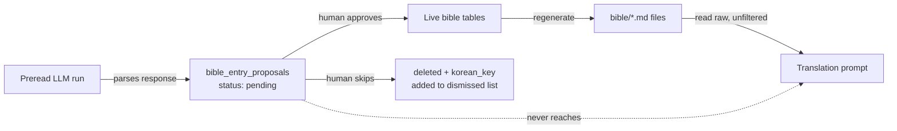

# Preread Review Staging + Bible DB as Source of Truth (Design)

**Status:** Design approved 2026-08-09, implementation plan approved 2026-08-09. **Fully shipped 2026-08-10 — Groups A through D all complete.** `Pipeline::BibleEntryDocWriter`/`BibleDocSynced`, the `bible_entry_proposals` staging table, `Pipeline::BibleEntryMatcher`/`BibleEntryProposalIngester`, `PrereadRunner` wired to the ingester, rebuilt review controllers + slideshow, `TranslationJob`'s translate lock, the backfill run against the real novel, and deletion of `BibleMarkdownParser`/`Pipeline::PrereadBibleWriter` — see `docs/DECISIONS.md`'s 2026-08-10 entries for the full sequence. This design doc is now a historical record of a completed migration, not an in-progress plan.
**Related:** `docs/RAILS_REFACTOR_PLAN.md` (R6 preread orchestration), `docs/DECISIONS.md` (2026-08-08 "known, deliberately unaddressed" bible/DB drift entry)

## The problem, in one sentence

Preread proposes new bible entries by appending raw text into `bible/*.md` files; those same files are also what gets fed into every translation prompt, unfiltered, whether or not a human has reviewed the proposal yet — and separately, correcting an entry through its own edit page updates the DB but never touches the file, so the two silently drift apart.

## Goals

- A proposed bible entry can never reach a translation prompt before a human approves it.
- Correcting an entry once means it's corrected everywhere — no second "also fix the file" step.
- Skipping a suggestion is permanent — it doesn't come back on the next preread pass over the same ground.

## Non-goals (for this design)

- Rewriting `voice_calibration.md` / `rendering_guide.md`'s pipeline — `rendering_guide.md` already has this problem solved correctly (`RenderingRuleDocWriter`); `voice_calibration.md` has no DB table backing it and is out of scope.
- Touching `post_translation_review` — already sunset per the 2026-07-30 soak decision.

## Overview

Two coordinated pieces:

1. **A staging table for preread proposals**, replacing the current "append to the same markdown file the prompt reads" approach.
2. **A per-chapter translate lock**, so a chapter can't be sent for translation while it still has unresolved proposals.

Live bible tables (`bible_characters`, `bible_locations`, `bible_terminology`, `bible_cultural_phrases`, `bible_story_entries`) never contain anything unapproved. Proposals live entirely separately until a human resolves them.



The key change from today: the arrow from proposals straight into the translation prompt (dashed line above) **does not exist**. Today it does — that's the bug.

## Part 1 — The staging table

New table: `bible_entry_proposals`

| column | type | notes |
|---|---|---|
| `novel_id` | fk | |
| `chapter_id` | fk | which chapter's preread run produced this — drives the translate lock |
| `entry_type` | string | `character` / `location` / `terminology` / `cultural_phrase` / `story` |
| `existing_record_id` | bigint, nullable | nil = brand-new entry; set = proposed change to an existing row |
| `korean_key` | string | same normalized-Korean matching key used today (`Pipeline::BibleUtils.normalize_korean`), for dedup within a batch |
| `fields` | jsonb | the proposed field values (name, definition, notes, etc.) |
| `status` | string | `pending` only, in practice — resolved rows are deleted, not archived (see below) |

**Where the matching logic goes:** `BibleMarkdownParser` already knows how to parse a markdown entry and decide "does this match an existing record, and if so, what fields actually changed" (`filter_pending`/`classify_entry`/`compute_field_changes`). That logic doesn't disappear — it just runs once, at ingest time, instead of on every page load:

- Preread's LLM response comes back as markdown text (unchanged).
- It gets parsed the same way it is today.
- Each parsed entry is matched against the live tables by Korean key.
- If it matches an existing record with no actual field differences → discarded, nothing to review.
- If it matches with differences, or matches nothing → one `bible_entry_proposals` row.

**Resolving a proposal:**
- **Approve** → write `fields` onto the live record (create if `existing_record_id` is nil, update otherwise), delete the proposal row.
- **Skip** → delete the proposal row, **and** append its `korean_key` to `Novel#preread_dismissed_keys` (this column already exists — reused as-is, not a new mechanism). Without this second step, a later preread pass over overlapping content would just propose the exact same thing again; this is the same permanence the current `preread_dismissed_keys` column already gives you today, so nothing new to build there.

This retires `BibleMarkdownParser#pending_entries`, `#dismissed_entries`, and the whole "diff the file against the DB on every read" apparatus. The review screen becomes a plain query: `chapter.bible_entry_proposals`. No parsing at review time, no drift possible, because there's nothing to drift — a proposal is a real row, not text.

## Part 2 — The translate lock

`TranslationJob` already has this exact shape of guard for `voice_calibration` jobs:

```ruby
validate :voice_calibration_chapter_reviewed, if: -> { voice_calibration? && chapter_start.present? }
```

Add the mirror for `translate_batch`:

```ruby
validate :chapter_bible_proposals_resolved, if: -> { translate_batch? && chapter_start.present? }

def chapter_bible_proposals_resolved
  unresolved = novel.chapters
                     .where(number: chapter_start..chapter_end)
                     .joins(:bible_entry_proposals)
                     .distinct
  if unresolved.exists?
    errors.add(:chapter_start, "has unresolved bible proposals — resolve them at /preread_review first")
  end
end
```

One real wrinkle: preread jobs run over a **range** of chapters (`chapter_start..chapter_end`), not always one chapter. The lock has to check every chapter in the *translate* job's own range against *its own* unresolved proposals — chapter 77 being fully reviewed doesn't unlock chapter 76, and vice versa. The query above already does this correctly (checks the translate job's range, not the preread job's).

## Part 3 — Making the DB what the translation prompt actually reads

Parts 1 and 2 guarantee nothing unapproved ever reaches a translation prompt. They don't yet fix the original bug from this conversation (editing an entry's own page doesn't update the file). That's a separate, smaller piece, and there are two ways to do it — pick one:

**Option A (recommended) — regenerate the `.md` file from the DB on every write.**
Exactly what `RenderingRuleDocWriter` already does for `rendering_guide.md`. Add an `after_commit` callback on each of the five bible models that rewrites that novel's corresponding `.md` file from all its current rows. `translate_batch/prompt_builder.rb` doesn't change at all — it keeps reading files, they just can never be stale anymore. Lowest risk: zero changes to the already byte-verified prompt-building code.

**Option B — make `load_reference_files` query the DB directly**, skip the file for prompt-building entirely. Removes the `.md` files' role as prompt input altogether, but touches the one shared choke point every translation-related prompt builder calls through (`translate_batch.rb`, `chapter_qa.rb`, `five_step_runner.rb`), so it's a more invasive change for the same end result.

Either way, this can be built and shipped independently of Parts 1–2 — it's what finally makes "I fixed it in the DB" mean "it's fixed."

## Rollout order

1. Add `bible_entry_proposals` table + model.
2. Point preread's writer at it instead of `PrereadBibleWriter#append_to_bible`.
3. Rebuild `/preread_review` and `BibleImportController` against the table (approve/skip become simple row operations, no more JSON-blob-of-approved/skipped-entries payload).
4. Add the `TranslationJob` validation.
5. Backfill: run a one-time script to reconcile every novel's current `pending_entries` output into either real proposal rows (for genuinely new/changed content) or straight file cleanup (for today's four stale entries) — this is also where today's Elly/Café/AD-AP/국힙원탑 mismatches get cleared out.
6. Ship Part 3 (Option A) so corrections made after this point never drift again.

`BibleMarkdownParser`, `PrereadBibleWriter`, and the `preread_dismissed_keys`-based diffing can be deleted once steps 1–4 are live and step 5's backfill is done — nothing else depends on them.

## Implementation plan (approved 2026-08-09)

Two UX decisions confirmed with the user before implementation:
- **Skip deletes the proposal row, as written above** — accepted including the resulting regression on the "Dismissed preread entries" list (full detail is lost once the row is gone; "Restore" becomes "eligible to be re-suggested next preread pass," not instant reinstatement). Not patched over with an undocumented archive table.
- **`/preread_review` moves to per-card immediate persist** — approve/skip fires immediately per card instead of accumulating client-side for one batch submit. The end-of-review summary/tally screen is removed as redundant. Slideshow nav, keyboard shortcuts, and inline editing are unchanged.

**Sequencing correction from the rollout order above: Part 3 ships before Part 1.** Shipping Part 3 (DB→file sync) last, as originally ordered, opens a regression window — once Part 1's step 2 cuts `PrereadRunner` over to writing proposals instead of appending to `.md`, nothing writes to `bible/*.md` until Part 3 lands, so approved entries would sit correctly in the DB but never reach the translation prompt. Part 3 has zero dependency on the staging table, so it ships first and closes that gap before it opens.

**Three gaps this design left open, now resolved:**

1. **Chapter attribution.** `PrereadRunner#run_batch` sends one LLM call per batch of chapter numbers and hands the whole batch's parsed markdown to the writer at once — no entry is tagged with which chapter produced it. Per entry, against its own batch's `batch_nums`: if it has a parsed `first_appearance_chapter` within `batch_nums.min..batch_nums.max` and a matching `Chapter` row exists, attribute to that chapter; otherwise (no chapter field, out-of-batch value, or `story` entries, which never parse one) attribute to `batch_nums.max`.
2. **`Pipeline::BibleFileEditor` is not deletable at the end of this project.** `Pipeline::BibleReviewWriter` (`post_translation_review`'s writer) still depends on it, and `post_translation_review` being "sunset" per the 2026-07-30 decision means disabled, not deleted. `BibleFileEditor` stays; the new DB→file writer doesn't use it (a full-state rewrite needs no lock/fresh-read the way append-based dedup does).
3. **`PrereadDismissController#create`** (dismiss-without-entering-the-slideshow, from each bible category page) maps onto `bible_entry_proposals#skip` on a real proposal id once `BiblePrereadDismissed#load_pending_preread_entries` returns real rows instead of parsed hashes.

**Schema:**
```ruby
create_table :bible_entry_proposals do |t|
  t.references :novel,   null: false, foreign_key: true
  t.references :chapter, null: false, foreign_key: true
  t.string  :entry_type,         null: false   # singular: "character" | "location" | "terminology" | "cultural_phrase" | "story"
  t.bigint  :existing_record_id                # nullable; no real FK — resolved via entry_type → model class mapping
  t.string  :korean_key,         null: false
  t.jsonb   :fields,             null: false, default: {}   # flat proposed values, not classify_entry's {was:,now:} diff shape
  t.string  :status,             null: false, default: "pending"
  t.timestamps
end
add_index :bible_entry_proposals, [ :novel_id, :entry_type, :korean_key ], unique: true
```
Uniqueness on `[novel_id, entry_type, korean_key]` makes ingestion idempotent across overlapping preread runs; `find_or_initialize_by` is the primary mechanism, the index is the concurrency safety net (rescue `ActiveRecord::RecordNotUnique`, retry as update).

**New/changed classes** (SOLID — parsing/matching stays decoupled from persistence and the controller):
- `Pipeline::BibleEntryMatcher` — pure `(novel, category, raw markdown) → classified entry hashes`, extracted from `BibleMarkdownParser`'s existing `parse_*`/`classify_entry`/`compute_field_changes`/`normalize_compare`.
- `Pipeline::BibleEntryProposalIngester` — owns persistence + chapter attribution, depends on the matcher.
- `Pipeline::BibleEntryDocWriter` — one class parameterized by category (not five), mirrors `RenderingRuleDocWriter`'s proven shape; output must round-trip through the matcher's parsing regexes since `dismissed_entries_for` keeps reading these files until final cleanup.
- `BibleDocSynced` concern (`app/models/concerns/`) — `after_commit` hook on all 5 bible models calling the doc writer, mirrors `Embeddable`'s declarative shape.
- `BibleEntryProposal#approve!`/`#skip!` — model owns resolution; controllers stay thin.

**Commit sequence** (full detail incl. spec-first coverage per commit in the session's plan artifact — not reproduced here to keep this doc scannable):
- **Group A** (ships first, ✅ done 2026-08-09): `BibleEntryDocWriter` → `BibleDocSynced` wired into all 5 models. Independently fixes the DB/file drift bug on its own.
- **Group B** (✅ done 2026-08-10): `bible_entry_proposals` table + model → extract `Novel#append_preread_dismissed_key!` → extract `BibleEntryMatcher` → add `BibleEntryProposalIngester` → wire `PrereadRunner` to it → rebuild `PrereadReviewController`/new `BibleEntryProposalsController`/trim `PrereadDismissController` → rebuild the slideshow view/JS for per-card persistence.
- **Group C** (✅ done 2026-08-10): `TranslationJob#chapter_bible_proposals_resolved` validation (mirrors existing `voice_calibration_chapter_reviewed`).
- **Group D** (✅ done 2026-08-10): backfill via one-off Rake task (not a migration — needs runtime file reads + human judgment on the named stale mismatches) → delete `BibleMarkdownParser`/`PrereadBibleWriter` + specs, leaving `BibleFileEditor` and the `preread_dismissed_keys` column intact. The backfill against the real novel found nothing pending (everything had already synced via Group A's `BibleDocSynced`), so the named stale mismatches (Elly/Café/AD-AP/국힙원탑) turned out to be already resolved by the time D1 ran — no proposals needed manual reconciliation. `Pipeline::BibleEntryProposalBackfill` and its rake task, being one-time tools whose only dependency was the class D2 deletes, were deleted alongside it.

**One deliberate UX regression from Group B, not previously called out in this doc:** the old slideshow showed word-level was/now diffs for entries updating an existing record (`compute_field_changes`, computed at file-parse time). `bible_entry_proposals.fields` stores only the flat proposed values (this doc's own Part 1 schema table already specified this), so that diff no longer exists once an entry becomes a proposal row. Recomputing it at render time would mean duplicating `BibleEntryMatcher`'s comparison logic in the view layer for a display-only feature — not done. The review card still shows an "Updating existing entry" vs. "New entry" badge (from `existing_record_id`), just not a per-field diff. Revisit if this is missed in practice.

**Status as of 2026-08-10: fully shipped and committed** on `translation-quality-pipeline` (14 commits across Groups A–D: B1 table/model, a same-day fix for a `skip!` dismissed-key vocabulary bug B1 shipped with, B2 `Novel#append_preread_dismissed_key!` extraction, B3 `BibleEntryMatcher` extraction, B4 `BibleEntryProposalIngester`, B5 `PrereadRunner` wiring, B6 controllers/routes, B7 slideshow view/JS, C1 the translate lock, D1 the backfill tool + real run, D2 deletion of the legacy parser/writer). Full spec suite green throughout, diffed against a stashed pre-change baseline after B1–B4 (identical 55 pre-existing failures both sides) and re-confirmed after every commit since (19-failure subset of the same list when run without `spec/system/`) — zero regressions at any step. Not pushed to origin as of writing. Nothing left to build against this design.
